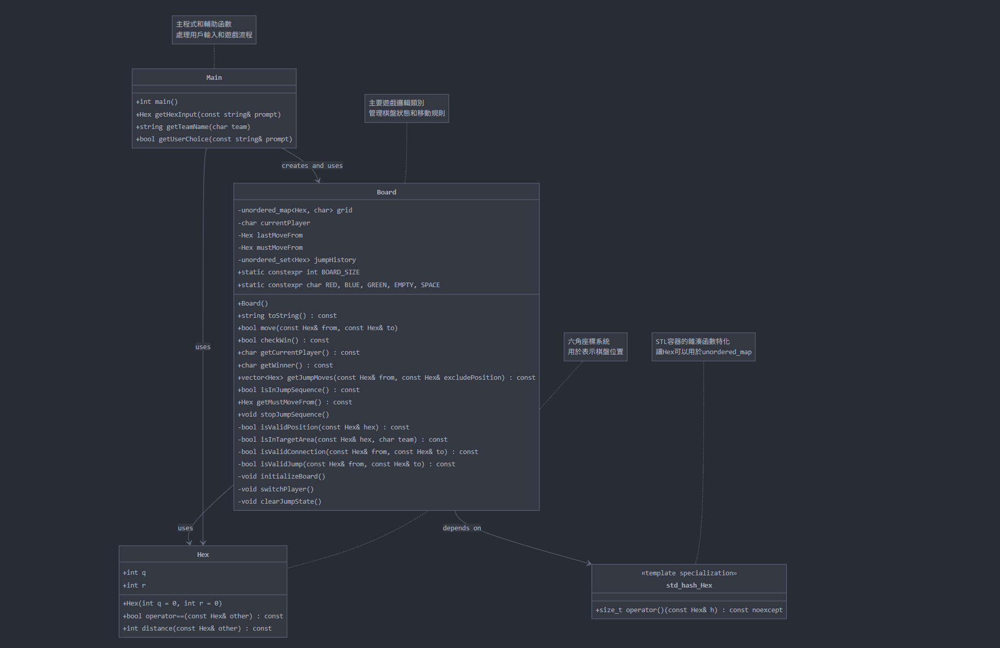

# 中國跳棋
## 物件專題介紹
 這是一個可以支援3位玩家的跳棋程式

## 小組分工
* 組長 : 黃允
* 組員 : 藍元懋、施旭嶸 
* 程式碼 : 黃允
* 報告 : 黃允
* GitHub、簡報製作 : 藍元懋
* 除錯 : 施旭嶸
## 程式遊戲規則
跳棋的棋盤有6個角，可供3人進行遊戲，每個人把各自同顏色的棋子擺滿一個角，按照規則輪流走棋，以最早旗子全部抵達並擺滿對角為優勝。對局將棋子互相間隔一個角擺放以平均分布。
每方棋子6枚，擺成等邊三角形。
## UML

## 程式運行畫面
### 初始棋盤

### 輸入座標移動

### 棋子在棋盤上移動

